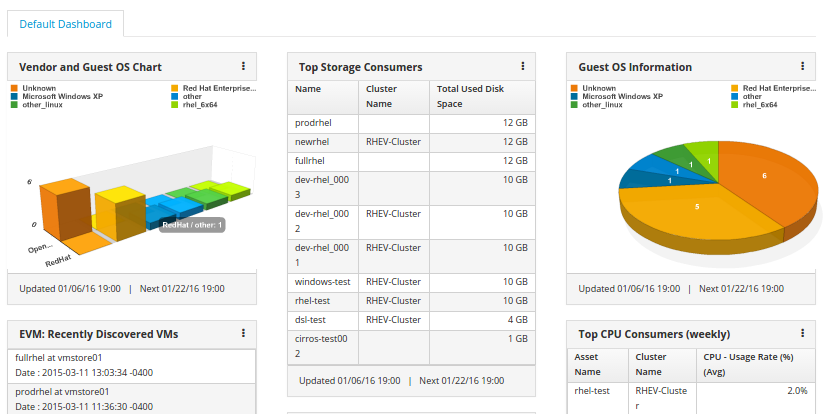
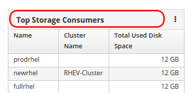
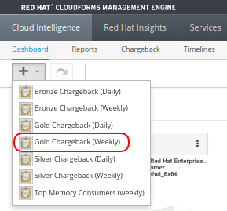
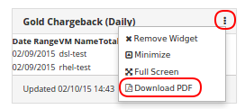
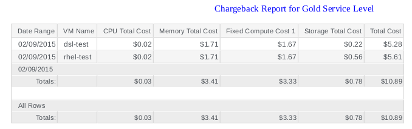

*Lab 1: Dashboard Overview*

The first item that will be seen after logging in is the dashboard. The dashboard is completely customizable and can be configured for each user, group, or tenant.  It utilizes widgets and allows for a quick overview of the environment and can provide visibility into almost any piece that CloudForms has insight into. 

*Part A: Moving and Adding Widgets*

To get started we will see that not only can we click on graphs and move the perspective around but we can also rearrange widgets by simply clicking on their title bar and dragging them.

. For this example click on the title "Top Storage Consumers" and drag the widget to the top of the page as shown above.

. We can also add additional Widgets by using the “+” icon at the top left.
. Now click on the “Gold Chargeback (Weekly)” Widget as shown below:

. Once we have our new widget click on the three dots on the top right.

. Widgets are basically a front end to reports which we will cover later, however they provide a quick shortcut to access that data in report form.  Click on the Download PDF button to see an example chargeback report.

It’s that simple. With Cloudforms it is quick and easy to view and arrange pertinent data in a single view.  

_Note: While we are logged in as the admin, other users would only see the data that is relevant to their role.  This will be covered later._