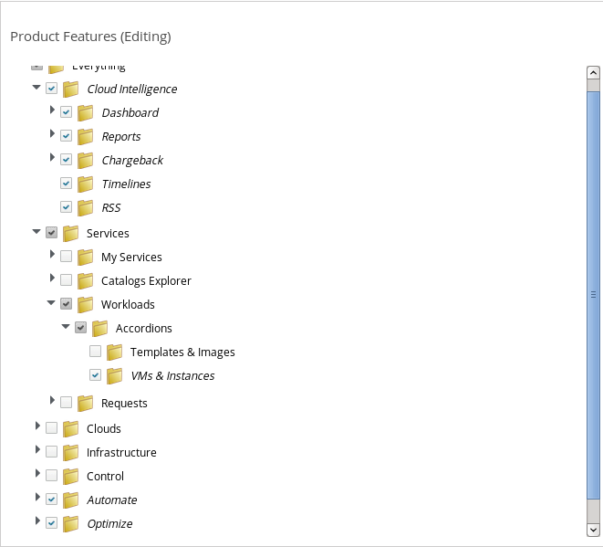

*Lab 2: Users and Dashboard Customization*

The next use case we will look at revolves around using CloudForms to examine capacity across all vendor platforms in a given environment. This type of high level reporting will give an executive level team a good idea of which environments can afford to take on more workloads and which environments are experiencing strain.

*Part A: Reset the Exec User Password*

In the interest of time the user "exec" has already been created and has been associated with the Group “EvmGroup-executive” and given the Role “EvmRole-executive”.  For reference, the instructions on how this was setup are at the end of this lab.

First we will reset the password for the exec user.

. Login as the “admin” user, navigate to “Configure > Configuration” and select the “Access Control” accordion.
. Expand the users section on the left and click on the exec user.
. Click the “Configuration” button followed by “Edit this User”

. Reset the user’s password to be” *redhat* ” by clicking the words “change stored password”

. Click Save

*Part B: Create New Executive Dashboard*

With CloudForms we do not necessarily want people to see the same thing when they log in. In this case we can customize the dashboard to only show information useful to the executive level users.

There are two ways that we can change the dashboard for specific users.  First we could log into CloudForms as that user and adjust the dashboard as desired as performed previously.  Although this will work, a better way is to define the dashboard based on the group the user resides in.

In this lab the “executive” user already has two dashboard tabs but we will add a third.  

. Remain logged in as the admin user, navigate to “Cloud Intelligence > Reports”.
. Navigate to the “Dashboards” accordion, select the “All Groups” folder and then select the “EvmGroup-executive” group.
. On the right side of the UI, select “Configuration > Add a New Dashboard.” 

. Name the dashboard “Super Executive Dashboard” In the Tab Title enter the name of the Tab. “Extra Overview” 
. Leave the “Locked” checkbox unchecked
. From the “Add a Widget” dropdown select the desired widgets to add to the dashboard. In my example I used: Top Memory Consumers (Weekly), Top CPU Consumers (Weekly), and Top Storage Consumers.

. Finish the dashboard creation by selecting the “Add” button
. Log out of CloudForms and log back in as the “exec” user. You should now see a third tab called “Extra Overview” to the right of “Chargeback Dashboard” and Executive View”.  

From here you can experiment with changing the page that we created. Feel free to try the following:

* Adding additional widgets by clicking the “+” button at the top Left of the page.
* Rearrange different widgets by dragging them around.
* Open a widget into a full report by clicking the maximize button on the top right of the widget.
* Export a widget into a pdf file by clicking the download button on the top right of the widget.

*Lab C: Create the Executive Account (Already done - for reference only)*

To create a new User/Group/Role for our executive user perform the following:

. Login as the “admin” user, navigate to “Configuration > Configure” and select the “Access Control” accordion
. Select the “Roles” category, then, on the right side of the screen, select “Configuration > Add a New Role”
. Name the role “exec” and complete the “Project Features” section to mirror the screen shot below:
+

+

. After creating the role, select the “Groups” folder in the “Access Control” accordion. On the right side of the screen, select “Configuration > Add a New Group”
. Name the group “exec” and assign the “exec” role the group from the drop down. Leave everything else as is and select “Add” to finish the group creation.
. After creating the group, select the “Users” folder in the “Access Control” accordion. Note that an “exec” user already exists. 
. Edit the “exec” user, so that the user’s group membership is set to the “exec” group. Also, reset the user’s password to be:  redhat

