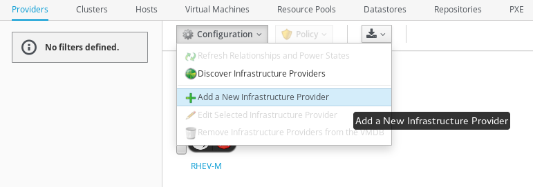

*Lab 3: Adding a New Provider*

In this lab, we’ll add an entirely new provider into CloudForms. A new Red Hat Enterprise Virtualization(RHEV) 3.5 environment has been created in your environment. By adding it into CloudForms, we’ll automatically discover what this environment can provide (templates, hosts, etc). In later labs, you will use these resources.

*Part A: Adding the Provider*

Adding a new provider is a simple workflow in CloudForms. First, navigate to the Infrastructure > Providers page. Currently, only one provider (an existing RHEV environment) should be displayed.

From the configuration drop down box, select "Add a New Infrastructure Provider," as shown below.

Note that the “Add a new Infrastructure Provider” dialog supports multiple provider types (VMware vSphere, Microsoft SCVMM, etc). In the drop down box for “Type,” choose “Red Hat Enterprise Virtualization.”

After selecting the RHEV provider type, the form will update and indicate what information is needed to proceed. Fill out the form with the same values as shown on the following page.

The password is: *redhat*

After filling in these values, the “Validate” will be displayed in blue. Click the button, wait a few seconds, and a green “Credential validation was successful” message should appear at the top of the page.

Click the “Add” button on the lower right.

*Part B: Viewing the Provider*

Once the provider has been added, wait 1-2 minutes for CloudForms to populate details about the new environment. Click on the my-rhev icon to view the provider.

Note that, once CloudForms has completed discovery, the icon representing my-rhev now includes a green check box, and the “Relationships” table on the far right of the page correctly displays the number of clusters, hosts, templates, etc, in the new environment. If your provider does not have this information displayed, wait another minute and then refresh the page.

The provider page in your environment will look similar to the example below.

Optionally, click through the clusters, hosts, and virtual machine tabs within the Infrastructure page to view more information about this new environment.