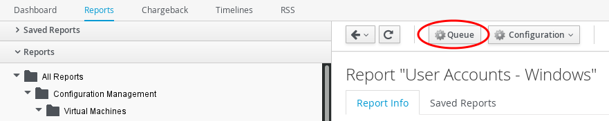
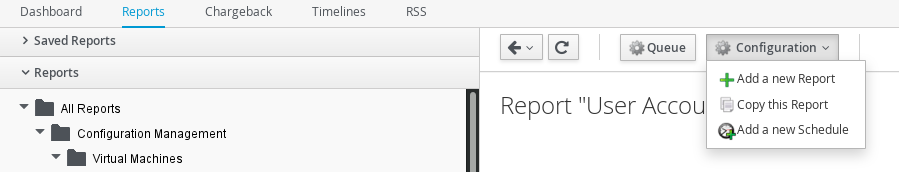
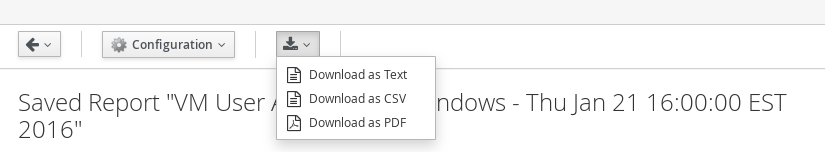
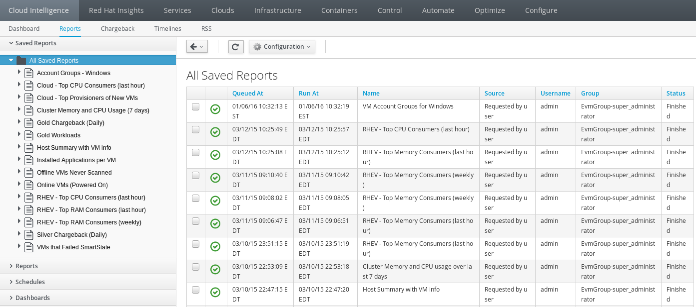
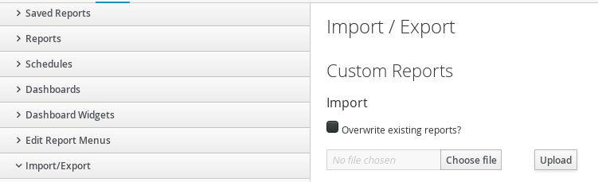

*Lab 4:* *Infrastructure* ** *O* *verview and* *Managing Reports*

A significant advantage of CloudForms is the ability to utilize tags inside of Cloudforms to create custom reports and manage previously built (brownfield) environments.  In this lab, we will look at the reporting system, run prebuilt reports, as well as import custom reports into our environment.

*Part* *A:* *Run and Schedule Reports*

Let’s start by looking at some of the reporting that is available in this instance of Cloudforms.  

. Navigate to "Cloud Intelligence > Reports" tab in the Cloudforms web UI
. Select the “Reports” accordion on the left.
. Feel free to explore the reports that are available by clicking on the arrow next to each folder to see what is inside.
. To run a report click on it then the “Queue” button to run it manually. 

Try running the following reports:

* All Reports -> Configuration Management -> Virtual Machines ->

“User Accounts-Windows”

* All Reports -> Configuration Management -> Hosts - >

“Hardware Information”

* All Reports -> Operations -> Virtual Machines

“Registered VMs by Free Space”

_Note: Depending on the detail the result can take a few seconds to a few minutes.  Also because the lab instances were just created, CloudForms does not have long term data to generate all reports._

. To Schedule a recurring report  choose “Configuration > Add a New Schedule”

_Note: this can also be performed through the “Schedule” accordion._

These reports can also be manually downloaded as either a Text, CSV or PDF file by clicking on the report that was generated and then the download button at the top of each report. 

In the example below, you’ll notice that we can view a large number of already generated reports.

Once finished the reports will show a green checkmark and the timestamp of when the report that was run.

*Part B: Run Custom Reports*

In addition to the “out of the box” reports included with CloudForms, it’s also possible to create custom ones. In this environment, several custom reports have been created. Note that these reports may also be imported and exported between appliances (as YAML files).

Go back to the “Reports” accordion and you should find the reports that were previously created at the bottom of the list under “Red Hat (ALL EVM Groups)”

Try running one of the following custom reports:

* Red Hat(All EVM Groups) -> Custom -> 

“Installed Applications Per VM”

* Red Hat(All EVM Groups) -> Custom -> 

“Group Quota Usage”

* Red Hat(All EVM Groups) -> Custom -> “Installed Applications Counts”

_Note: Once again you can find any reports that you have previously ran under the “Saved Reports” accordion tab._

*Part C: Importing Reports  (Already done - for reference only)*

In this Lab all the custom reports have been previously loaded, however the process to do this is very simple.

Click on the accordion “Import / Export” 

* Then click on “Choose file” followed by “Upload”

