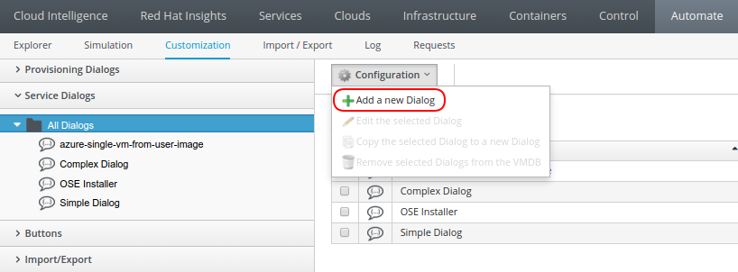
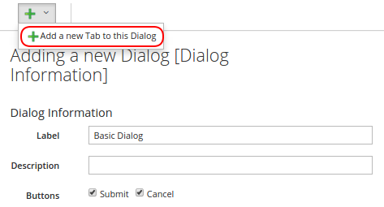
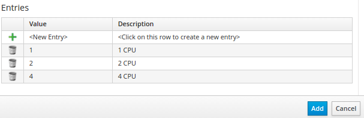
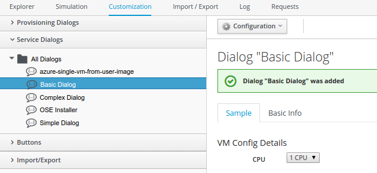
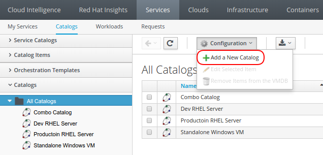
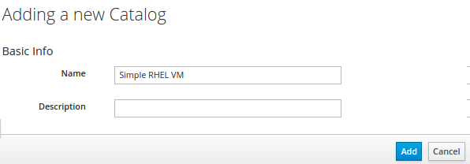
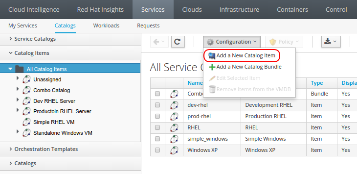
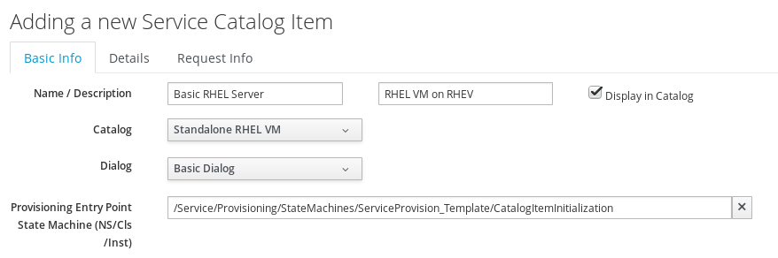
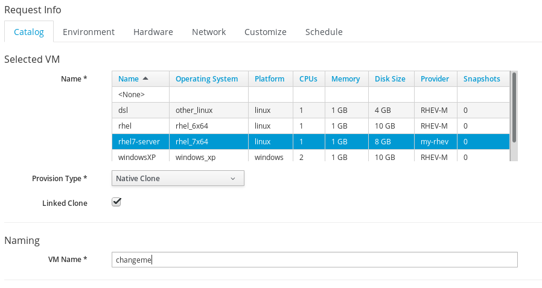
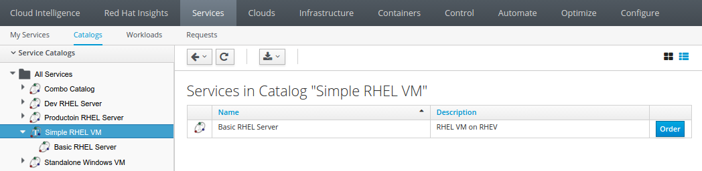

*Lab* *5* *:* *Service Catalog Provisioning*

Service Dialogs are used to enable a user to request or order a service, which can be arbitrary, but is usually one or more virtual machines. The administrator can present a simple interface to the user, allowing the user to only need to input a small amount of information. All other required provisioning information will be either hard coded behind this dialog or dynamically generated based on internal logic. 

Service Catalogs are comprised of two components.  A Service Dialog is what the user will typically see when ordering a service, and a catalog item which describes that item.  Think of it as a cover design on an encyclopedia. The design of the book would be the Service Dialog, while the contents (including volume number) would be part of the catalog item.  This allows the operator to build multiple catalog items quickly by reusing the same form and layout.

*Part* *A: Create a Simple Service Dialog*

In this example we will simply ask the user how many CPUs to utilize in the provisioning of the catalog.

. Navigate to the "Automate > Customization" section, select the “Service Dialogs” accordion.
. Select the “All Dialogs” folder, then select “Configuration > Add a new Dialog”

. Enter “Basic Dialog” as the label.
. Make sure the “submit” and “cancel” buttons are checked. *(DO N* *OT CLICK ADD)*
. Select  green “+” button, then “Add a new Tab to this Dialog,” then add “Provisioning Details” as the label.

. Select the green “+” button, then “Add a new Box to this tab,” add “VM Config Details” as the label
. Select the green “+” button, then “Add a new Element to this Box,” and furnish the following value:
  .. “Label” = CPU 
  .. “Name” = options_0_number_of_sockets 
  .. “Description” = CPU 
  .. “Type” = Drop Down List
. In the “Entries” box at the bottom
. Select the green “+” to add the Values: 
  .. Add “1” as the value and “1 CPU” as the description
  .. Add “2” as the value and “2 CPU” as the description
  .. Add “4” as the value and “4 CPU” as the description

***You must hit the green “+” sign to save the previous entry (or pres* *s the “Enter” key after filling in the description)* *even if you don* *’* *t intend to add another***

. Select the “Add” button to save the dialog

The “Basic Dialog” service dialog has been creating, and we can use this to attach to a catalog we will build in the next steps.  When finished it should resemble the following: 

*Part* *B: Create a Single Item Catalog*

. Navigate to “Services > Catalogs” and select the “Catalogs” accordion
. Select the “All Catalogs” folder, then “Configuration > Add a New Catalog”

. Name the catalog “Simple RHEL VM” and select the “Add” button

. Now select the “Catalog Items” accordion
. Click “Configuration” and then “Add a New Catalog Item,” select the “Catalog Item Type “RHEV” since we are utilizing a RHEV environment.

. In the “Basic Info” tab, enter “Basic RHEL Server” for “Name” and “RHEL VM on RHEV” for “Description”.
. Check the “Display in Catalog” checkbox, in the Dialog.
. Choose the “Simple RHEL VM” from the “Catalog” drop down.
. Choose “Basic Dialog” from the “Dialog” drop down.
. Click the “Provisioning Entry Point (NS/Cls/Inst)” option and choose “/ManageIQ/Service/Provisioning/StateMachines/ServiceProvision_Template/CatalogItemInitialization”, then click on “Apply.” At this point, your catalog item should look similar to the example below.

. Select the “Request Info” tab at the top of the screen
. Choose the “rhel7-server” template to use for the VM, set provisioning type to “Native Clone”, select the “Linked Clone” check box, and use “changeme” for the VM name.

. In the “Environment” tab, select “Choose Automatically”.
. In the “Network” tab verify that the vLan “rhevm” is selected.
. Select the “Add” button to finish the catalog creation.

*Part C: Testing our New Catalog Item*

. Navigate to “Services > Catalogs” and select the “Service Catalogs” accordion.
. Under “All Services” you should see the “Basic RHEL Server” catalog item listed within the “Standalone RHEL VM” catalog.
. Select the “Basic RHEL Server” item and click the “Order” button on the right.

. From here you can select the number of CPU’s for the new machine. Please choose “1 CPU” and click “Submit”.

You will now be taken to the Service > Requests tab to see the status of the machine that you ordered.  Since we are logged in as the admin user the order will automatically be approved.  This process typically should take 5-10 minutes and will show a green checkmark on the bottom left side and the status will show “Finished”. Periodically, either refresh this page in your browser, or click the “Reload” button in the upper left.

_Note: Since the lab is utilizing three layers of virtualization this may take a significant amount of time._

