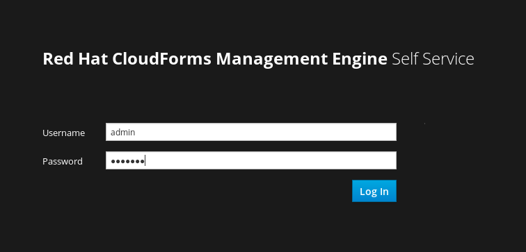
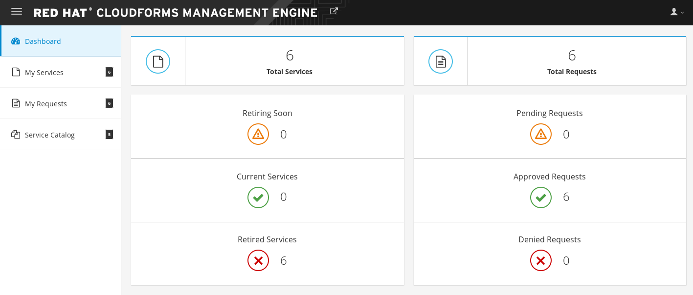
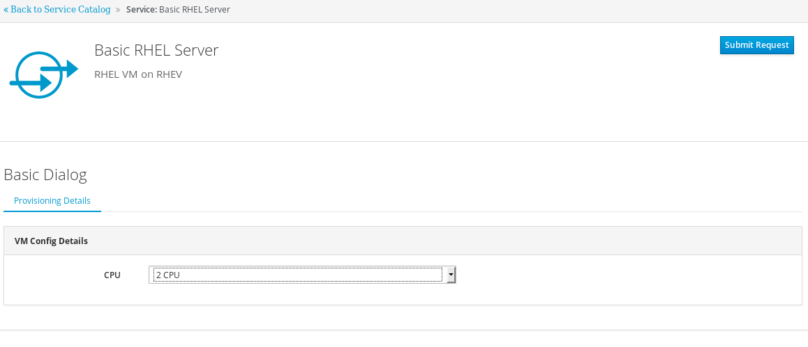

*Lab* *6* *:* *Self-service Interface*

In the previous lab, we created and tested provisioning via a service catalog item. For end user self service, users may expect a simpler and friendlier interface than the administrator view we have used up until this point.

In this lab, we’ll test our service catalog item in CloudForm’s new self service interface.

*Part* *A* *: Logging into the Self Service Interface*

To log into the self service interface, simply open a new tab in your browser and navigate to:

*http://<cloudforms>/self_service*

Please substitute <cloudforms> for the FQDN or IP address you were given for your instance of CloudForms.

At the login page, login via the "admin" login you were previously using.

After logging in, you’ll see an interface similar to the example on the next page. Take a moment to click into and view the four tabs to the left of the interface: Dashboard, My Services, My Requests, and Service Catalog.

*Part* *B:* *Ordering a Service Catalog Item*

When an end user wants to request or order a service, he or she would visit this interface and order a service catalog item.

Test provisioning in this manner by first navigating to Service Catalog, and then select the “Basic RHEL Server” item and order another VM.

To view the progress of this provisioning, click on the request in the “My Requests” tab. As before, since nested virtualization is in use, the provision process will go slowly and take more time than it would on bare metal.