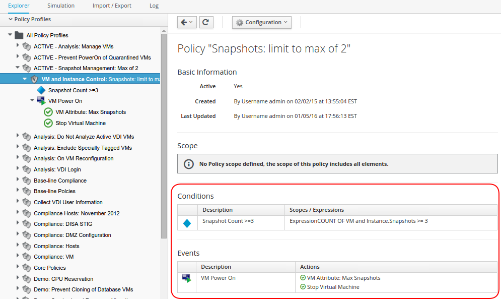
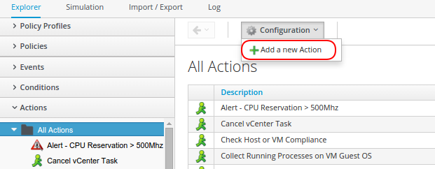
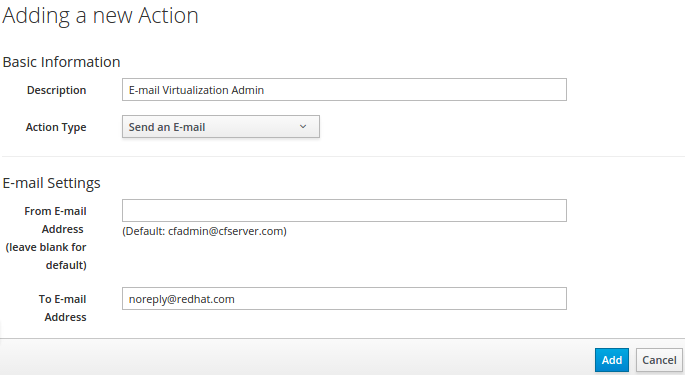
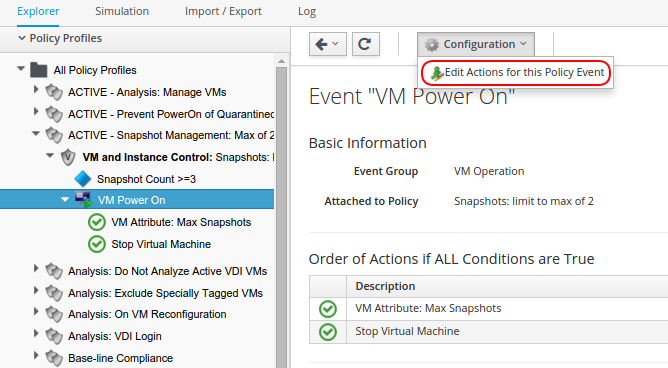
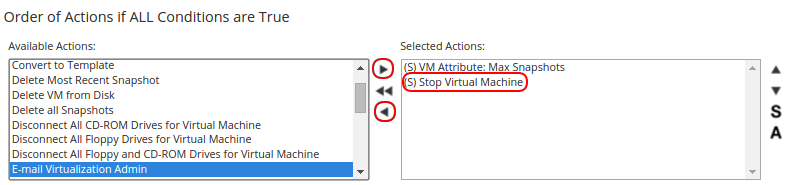
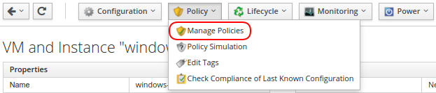
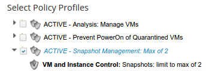

*Lab* *7* *: Automating IT Processes with Policies*

In this lab, we are going to use policy a control to alert when too many snapshots are created and apply it to just a single VM. 

Since no one wants to develop all of their own policies from scratch the ability to easily import and export policies is paramount, however in the interest of time this has already been performed.

_Note: If you wanted to import policies this can be permed using the "Import/Export tab._

*Part A:  Managing and Editing Policies*

Now that we have added external policies, we can now customize one of them.

. Navigate to “Control > Explorer" Select the “Policies Profiles” accordion
. Select “All Policy Profiles > ACTIVE - Snapshot Management: Max of 2”
. Click on “VM and Instance Control: Snapshots: limit to max of 2”

You should see the following:

In the Red box we see the three components of a policy: Event(s), Condition(s), and Action(s).

Stopping a  VM just because it has too many snapshots is a bit extreme.  Instead we will change that to sending an email out when this condition occurs. 

_Note: There are numerous predefined actions that we could use(Including removing the offending snapshots) or we could build our own._

To Create a new Action:

. Navigate to the “Actions” accordion
. Then click “Configuration” > “Add a new Action”

. From the “Action type” field, select “Send an E-mail”
. Give it a description, e.g. “E-mail Virtualization Admin
. In the “To E-Mail Address” field provide either your e-mail or a fake address.
. Click “Add”

Now to apply our newly created action to our Policy:

. Navigate back to “Control > Explorer” Select the “Policies Profiles” accordion
. Select “All Policy Profiles > ACTIVE - Snapshot Management: Max of 2” > “VM and Instance Control: Snapshots: limit to max of 2”
. Click on “VM Power On”
. Choose “Configuration” > “Edit Actions for this Policy Event

. Now select the new action “E-mail Virtualization Admin then press the top arrow.
. Then select the “(S)Stop Virtual Machine” Action on the Right and press the bottom arrow.

. Once you see only the “(S) VM Attribute Max Snapshots and E-mail Virtualization Admin” actions in the right box click “Save”

*Part B* *: Assign and Testing the Policy Profile*

Now that we have our updated policy, we need to assign it to the correct resources. 

A policy or policy profile can be assigned to almost every element of “Infrastructure” or “Cloud” environments. You could assign this policy profile to an entire provider to establish a “Baseline” set of rules for an entire environment or a specific cluster within a provider.

In the example below, we are going to show how to assign a policy to a specific VM.

. Navigate to “Infrastructure > Virtual Machines,” and look for the “windows-test” virtual machine.

_Note:_ _T_ _hat a gold shield icon is_ **__not__** __ _present indicating that no policy is currently applied._

. Click on the VM, then select the “Policy > Manage Policies” options from the down menu

. Click the “ACTIVE - Snapshot Management: Max of 2” box and then the “Save” button.

. Now that we have assigned this policy profile to the VM “VMs & Templates” accordion on the left and the “All VMs & Templates” folder.
. Note that a gold shield icon now is present for the “windows-test” virtual machine, indicating that a policy profile is assigned.  

_Note: that we can’t actually test it as the “windows-test” VM isn’t actually there, but it was a real environment it would!_

