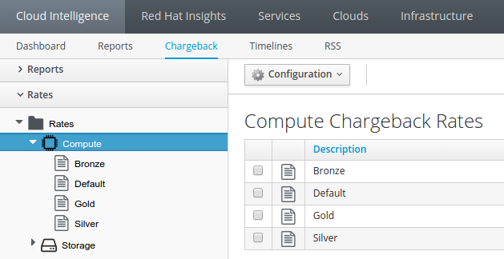

*Lab 8: Tagging and Cost Analysis*

Access to a chargeback model is top of mind for a lot of organizations. Chargeback allows for organizations to assign monetary values to certain compute properties of an environment. CloudForms allows us to set up different rate tables for different organizations, service levels, etc. to completely customize the price of workloads depending on what environment they are running in.

In this lab, we will configure rate tables based on service levels to generate chargeback reports for executive review.

*Part A: Tag Environments with Service Level Tags*

Chargeback reports can be filtered by Custom Tags, which allow users to run reports against specifics departments, cost centers, lines of business, etc.

To develop reports based on service level we must first tag resources with the appropriate tags. This can be done at the individual VM, through a particular cluster/provider, or even though policies.  

To tag individual VM(s).

. Log in as the Admin user, navigate to "Infrastructure > Virtual Machines".
. Click on the RHEV-M on the left to view all RHEV VMs and templates.
. Click the checkbox on the “newrhel” VM.
. Select the “Policy > Edit Tags” button.

. Under the “Tag Assignments” section, select the “Service Level” category from the drop down and then assign the “Bronze” tag,
.  Click “Save” to commit changes.

_Note: This process has already been done for both the “Silver” and “Gold” service tags (and different VMs)_

*Part B: Compute Rate Tables for Each Service Level*

Now that we have tagged the appropriate resources with their respective service levels, we need to create rate tables that we will eventually associate with each service level.

Rate tables allow us to set different monetary values for our resources so we can assign different values to separate environments or tagged resources. For instance, we can set up a production rate table for an entire VMware prod environment or we can set up that same production rate table for a set of resources tagged with the “Production” tag.

**__Note: For the sake of time the compute rate tables have already been added into the lab.__**

 They can be viewed and edited by performing the following:

. Navigate to “Cloud Intelligence > Chargeback” Select the “Rates” accordion on the left side of the UI
. Under the “Rates” accordion, select “Rates > Compute”
. Click on a Rate type (Bronze, Silver, Gold)
. On the right side of the UI, select the “Configuration > “Edit this Chargeback Rate” 
. Make appropriate changes and click “Save”.

*Part C: Setup Storage Rate Tables for Each Service Level*

Now let us setup a Tier 2 storage cost object for non critical storage such as ISO image files. 

. Navigate to “Cloud Intelligence > Chargeback” Select the “Rates” accordion then “Storage”
. Click “Configuration” and then “Add a new Chargeback Rate”

. Under Basic Info, Description type “Tier 2”
. Fill out the rates as shown.

+

. Click “Add”

*Part D: Assigning Rates to a Service Level* 
+

Now that we have set up rate tables for our compute and storage resources we need to assign them to our service level tags. *For the sake of time the compute rate tables have already been added into the lab.*

. Navigate to “Cloud Intelligence > Chargeback” Select the “Assignments” accordion on the left hand side of the UI
. Select “Storage” under the “Assignments” accordion and note that the Rate assignments match the Tag assignments. (e.g. Silver = Silver) 

Now let us set our new Tier 2 storage rate to the ISO storage device.
+

. Still under the “Assignments” accordion, select the “Storage” option
. Change the “Assign To” dropdown to “Selected Datastores”
. Change the ISO_DOMAIN and isos selections “Rate” to “Tier 2”
. Select “Save” to commit changes

Now that we have updated the rate tables and assigned them to resources, we will see the changes in the various (Bronze, Silver, Gold) Chargeback reports we ran previously.

+

+

